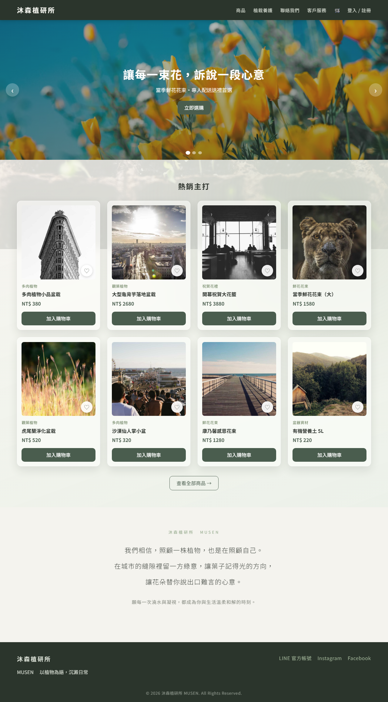
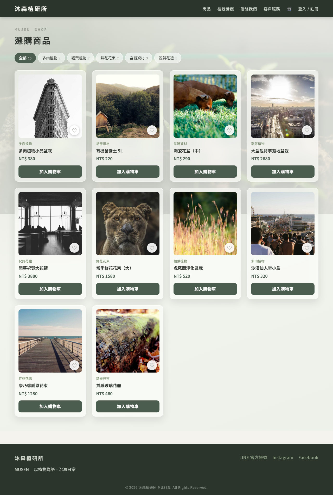
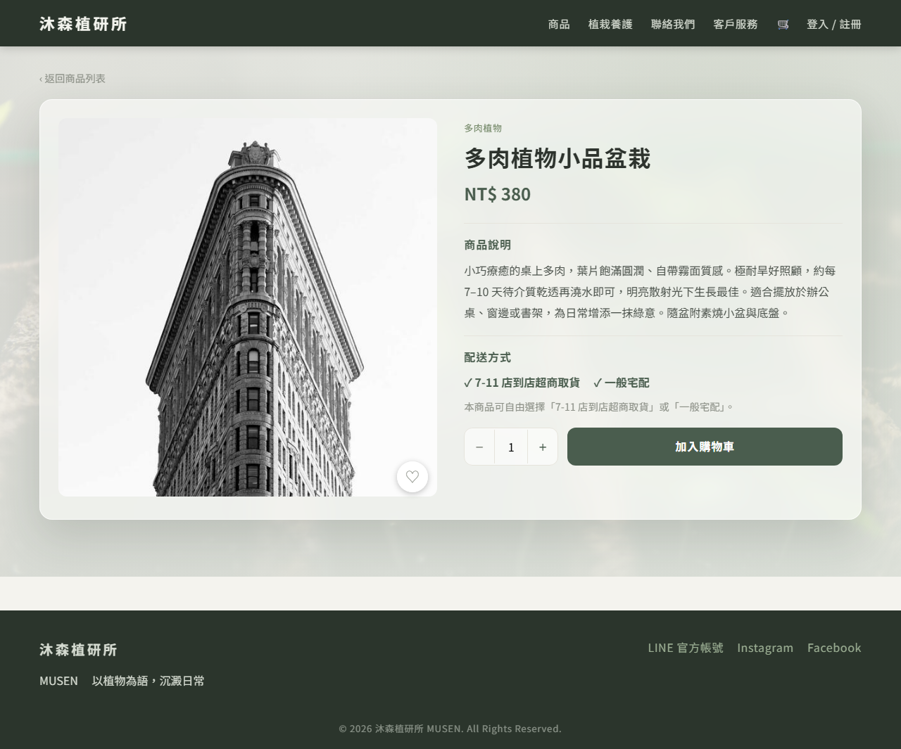
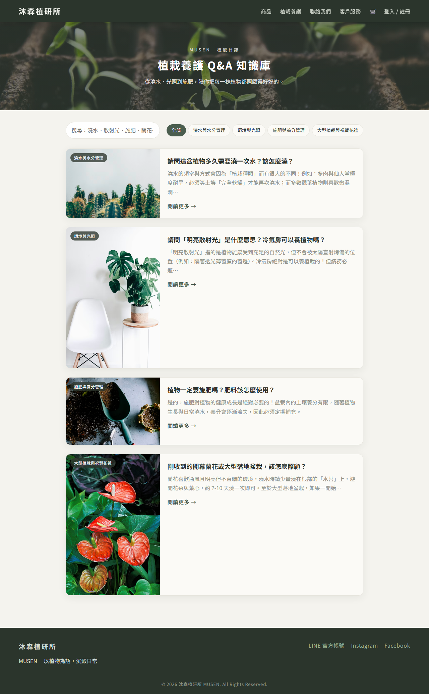
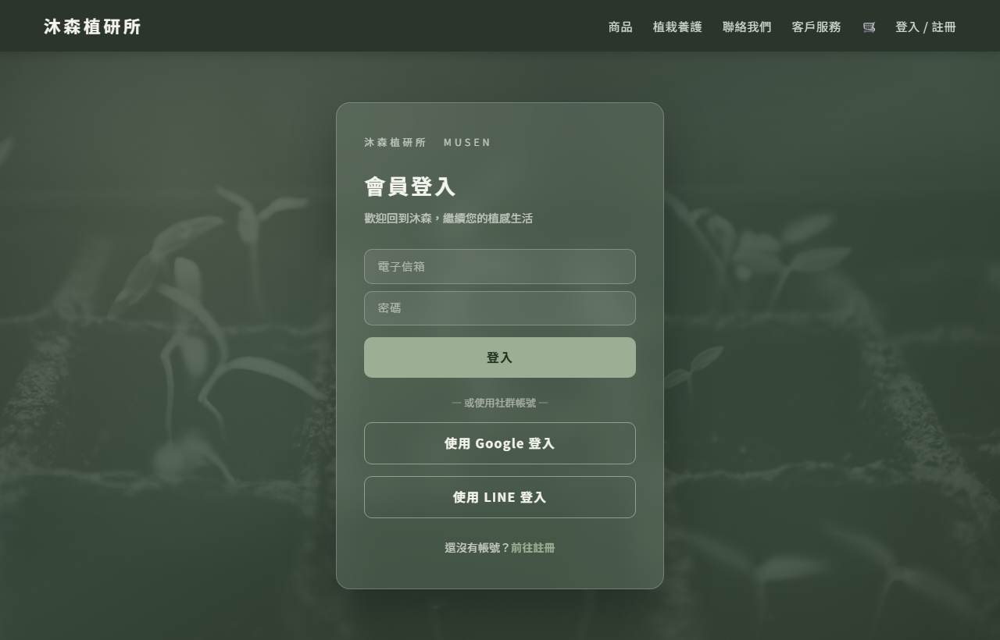
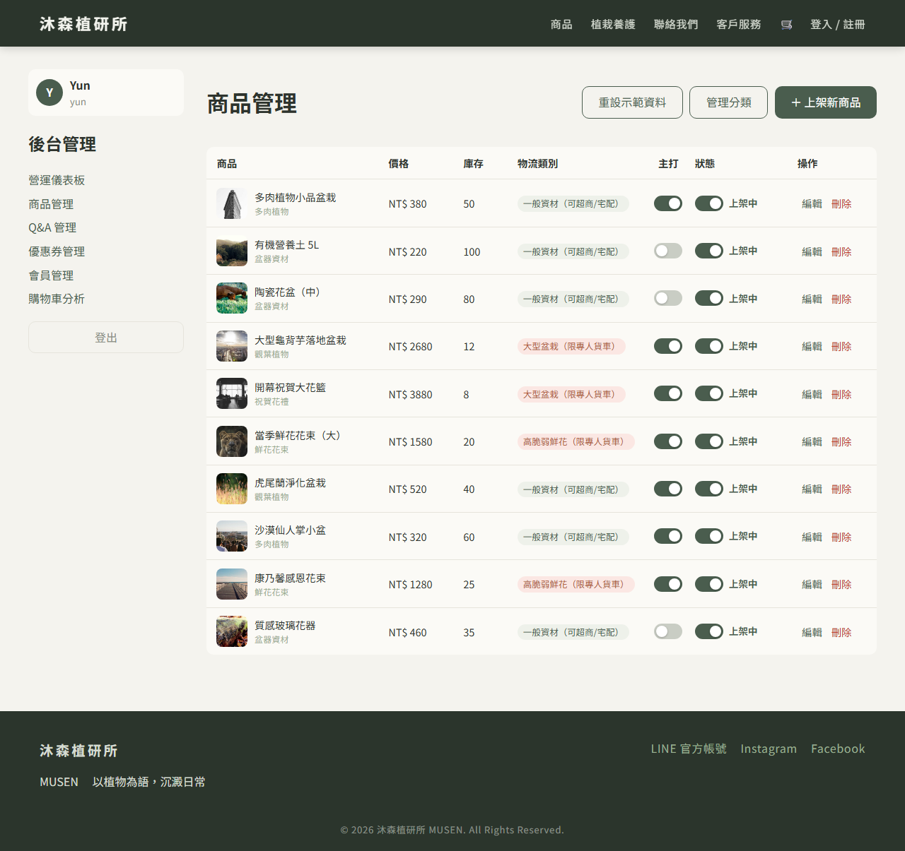

# 沐森植研所 MUSEN｜花店新一代官網暨智慧電商系統

> 以植物為語，沉澱日常。

精品花店的數位官網暨電商平台 — 前後端分離架構，主打**雙軌物流智慧過濾**（一般資材 vs. 大型／脆弱植栽）、送禮客製化、會員與優惠券系統，並整合在地化金流與第三方登入。


---

## 📸 畫面預覽

| 首頁（輪播 + 主打 + 品牌宗旨） | 商品列表（玻璃風 + 分類） |
| --- | --- |
|  |  |

| 商品詳情（說明 + 配送 + 數量） | 植栽養護 Q&A（部落格風） |
| --- | --- |
|  |  |

| 會員登入（毛玻璃質感） | 後台商品管理（上下架/主打開關） |
| --- | --- |
|  |  |

---

## ✨ 功能特色

### 🛍 使用者端
- **首頁**：自動輪播 Banner、熱銷主打商品（玻璃卡）、文青風品牌宗旨
- **商品列表 / 詳情**：分類頁籤過濾、毛玻璃質感、收藏愛心、商品說明與**配送方式說明**、數量選擇
- **購物車**：數量即時增減、小計重算、購物車交叉銷售（你的專屬收藏）
- **智慧結帳**：雙軌物流防呆、送禮客製化表單、優惠券折抵
- **會員系統**：訂單狀態軸、常用地址、積分折價券、收藏清單；Google / LINE 一鍵登入、Email 驗證碼註冊
- **植栽養護 Q&A**：部落格式知識庫，分類 + 關鍵字搜尋 + 手風琴展開
- 加入購物車 **Toast 提示**

### 🛠 管理端（後台）
- **管理員登入**（毛玻璃風）與權限守衛
- **商品管理**：上架 / 編輯 / 刪除、**上下架與主打 Switch 開關**、**圖片檔案上傳**（自動縮圖）、整列點擊編輯
- **商品分類管理**：新增 / 改名 / 刪除（前台分類頁籤連動）
- **Q&A 管理**：與前台知識庫連動
- 營運儀表板、優惠券、會員、購物車分析（規劃中）

---

## 🧱 技術棧

| 層級 | 技術 |
| --- | --- |
| 前端 | Vue 3 (Composition API) · Vite 6 · Vue Router · Pinia · Axios |
| 後端 | Java 17 · Spring Boot 3 · Spring Security · Spring Data JPA |
| 資料庫 | PostgreSQL 16（Flyway 版本控管） |
| 金流 | 綠界科技 ECPay |
| 第三方 | Google OAuth · LINE Login & Messaging API · EmailJS |
| CI | GitHub Actions（push 自動 build 前端） |

> 目前前端為可獨立運行的完整 Demo（商品 / Q&A / 分類 / 圖片以 LocalStorage 模擬，無需後端即可操作）；後端為對應的 Spring Boot 骨架，安裝 JDK 17 後可編譯執行。

---

## 📁 專案結構

```
musen-flower-shop/
├── frontend/                 # Vue 3 + Vite SPA
│   └── src/
│       ├── views/            # 頁面（home / product / checkout / member / admin / auth ...）
│       ├── components/       # layout / checkout / auth / ui
│       ├── stores/           # Pinia（cart / auth / wishlist / productAdmin / category / qaAdmin / toast）
│       └── api/              # Axios 實例與 API 模組
├── backend/                  # Spring Boot RESTful API（商品 / 購物車 / 訂單 / 優惠券 / 會員 / 金流 / 通知）
│   └── src/main/resources/db/migration/   # Flyway schema + seed
├── docs/screenshots/         # README 截圖
├── .github/workflows/        # GitHub Actions
└── docker-compose.yml        # 本機 PostgreSQL + Adminer
```

---

## 🚀 快速開始

### 前端
```bash
cd frontend
cp .env.example .env.local      # 設定 API / 金鑰（可選）
npm install
npm run dev                     # http://localhost:5173
```

### 後端（需 JDK 17+）
```bash
docker compose up -d            # 啟動 PostgreSQL（可選）
cd backend
./mvnw spring-boot:run          # http://localhost:8081
```

---

## 🔑 Demo 帳號

**後台管理員登入** `/admin/login`

| 帳號 | 密碼 |
| --- | --- |
| `yun` | `1234` |
| `admin` | `1234` |

> 前端為 Demo 驗證；正式環境改由後端簽發 JWT。

---

## ⭐ 核心亮點：智慧物流過濾（最高物流限制原則）

購物車中只要含任一「大型盆栽」或「高脆弱鮮花」（`logisticsClass = BULKY / FRAGILE`），即**全車強制鎖定「專人貨車外送」並停用超商取貨**，並跳出溫馨提示。

- 前端即時呈現：`frontend/src/stores/cart.js`
- 後端權威防呆：`backend/.../cart/LogisticsRuleService.java`（含單元測試，防止前端被繞過）

---

## 📋 規格對照

| 規格章節 | 前端 | 後端模組 |
| --- | --- | --- |
| 前台展示 | `views/home` `views/QaView` | `content` |
| 會員系統 | `views/member` `stores/auth` | `member` `auth` |
| 智慧物流過濾 ⭐ | `stores/cart` `views/checkout` | `cart` |
| 送禮客製化 | `components/checkout/GiftForm` | `order`（GiftInfo） |
| 優惠券引擎 | `views/checkout` | `coupon` |
| 收藏與交叉銷售 | `stores/wishlist` | `wishlist` |
| 後台管理 | `views/admin/*` | `admin/*` |
| 資安 | Axios interceptor、XSS 轉義 | `SecurityConfig`、Rate Limiting |

---

## 🤖 CI/CD

每次 push 到 `master`（變更 `frontend/`）時，GitHub Actions 會自動安裝相依套件並 `npm run build`，驗證前端可正常建置，產物作為 artifact 上傳。詳見 [`.github/workflows/frontend-build.yml`](.github/workflows/frontend-build.yml)。
